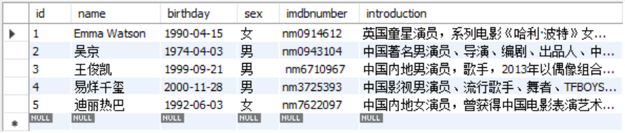

# 构建MovieDB

### 创建基本表如图




### 修改Table Movie，增加评分列并update评分数据


# 基于电影数据库的简单查询

## 1.查询所有电影的电影名、时长与上映日期


### 2.查询年龄小于40岁的女演员的姓名和年龄


### 3.查询所有艺人演出的电影ID及角色名


### 4.查询全世界各洲（Continent）的名称


### 5.查询南美洲人口数量小于1千万的国家，并按人口由多到少排序


### 6.查询欧洲国家的数量


### 7.查询人最多和人最少的国家的人口数量（0除外）


### 8.查询演员出生地都有哪些（结果不能重复）


# *附sql代码

```
USE MovieDB;

CREATE TABLE if not exists Artist(
  id INT(4) PRIMARY KEY AUTO_INCREMENT,
  name VARCHAR(100) NOT NULL,
  birthday DATE,
  sex VARCHAR(10),
  imdbnumber VARCHAR(20),
  introduction TEXT
);

CREATE TABLE if not exists Movie(
  id INT(4) PRIMARY KEY AUTO_INCREMENT,
  name VARCHAR(100) NOT NULL,
  releasedate DATE,
  duration INT,
  language VARCHAR(50),
  introduction TEXT
);

CREATE TABLE if not exists Participation(
  id INT(4) PRIMARY KEY AUTO_INCREMENT,
  artistid INT,
  movieid INT,
  rolename VARCHAR(50),
  FOREIGN KEY(artistid) REFERENCES Artist(id),
  FOREIGN KEY(movieid) REFERENCES Movie(id)
);

INSERT
INTO Artist(name,birthday,sex,imdbnumber,introduction)
VALUES('Emma Watson','1990-04-15','女','nm0914612','英国童星演员，系列电影《哈利·波特》女主角，主演《美女与野兽》《小妇人》。'),
      ('吴京','1974-04-03','男','nm0943104','中国著名男演员、导演、编剧、出品人、中国电影家协会副主席，代表作《战狼》《长津湖》《流浪地球》'),
      ('王俊凯','1999-09-21','男',' nm6710967','中国内地男演员，歌手，2013年以偶像组合TFBOYS组合队长的身份正式出道，主要作品有《天坑鹰猎》《重生之门》《解忧杂货店》《断·桥》《万里归途》《野孩子》《刺猬》《749局》等。'),
	  ('易烊千玺','2000-11-28','男','nm3725393','中国影视男演员、流行歌手、舞者、TFBOYS成员，连续三年提名中国电影金鸡奖最佳男主角奖'),
	  ('迪丽热巴','1992-06-03','女','nm7622097','中国内地女演员，曾获得中国电影表演艺术学会金凤凰奖新人奖、中国电视金鹰奖观众喜爱女演员奖等荣誉');
      
INSERT
INTO Movie(name,releasedate,duration,language,introduction)
VALUES('解忧杂货店','2017-12-29',109,'Chinese','本片根据日本著名推理作家东野圭吾的同名小说改编。在一个漆黑的夜晚，阿杰（董子健 饰）、小波（王俊凯 饰）、彤彤（迪丽热巴 饰）等三个年轻人盲打误撞来到了一个名为“解忧杂货店”的破旧小屋。他们闯了进去，
             却意外发现这里的时光不仅似乎停滞，而且仿佛停留在遥远的1993年。正在这时，一封信从投信口推了进来。写信的人似乎有各种各样的烦恼，而小波他们不知不觉扮演起人生导师，字斟句酌为烦恼之人写下回信。
             门的另一边，内向的画家浩博（秦昊 饰）、北漂摇滚青年秦朗（李鸿其 饰）、功成名就的女企业家大晴美（郝蕾 饰）与三个素未谋面的年轻人建立起了跨越是空的心灵交流……'),
 	  ('长津湖','2021-09-30',176,'Chinese','电影以抗美援朝战争第二次战役中的长津湖战役为背景，讲述了一段波澜壮阔的历史：71年前，中国人民志愿军赴朝作战，在极寒严酷环境下，东线作战部队凭着钢铁意志和英勇无畏的战斗精神一路追击，奋勇杀敌，扭转了战场态势，打出了军威国威。'),
	  ('Harry Potter and the prisoner of Azkaban','2004-05-31',141,'English','哈利即将在霍格沃兹渡过第三个年头，此时在阿兹塔班却传出恶棍小天狼星越狱的消息。据说小天狼星正是背叛哈利父母的好友，他的教父，
            而这次小天狼星越狱似乎正是为了找他。哈利的心里悄悄的滋生了为父母报仇的想法，期待着小天狼星的出现。新来的魔法老师卢平有着桀骜不驯的个性，与哈利关系很好，教了哈利许多实用的黑魔法防御知识。
            而此时在他的魔法地图上却出现了一个神秘人物，虫尾巴。偶然的机会下，在尖叫棚屋里集齐了哈利父亲当年的所有好友，卢平、虫尾巴、小天狼星，哈利的魔杖直指向小天狼星，但他发现那罪犯看他的眼神里充满了疼爱…… '),
	  ('少年的你','2019-10-25',135,'Chinese','陈念是一名即将参加高考的高三学生，同校女生胡晓蝶的跳楼自杀让她的生活陷入了困顿之中。胡晓蝶死后，陈念遭到了以魏莱为首的三人组的霸凌，魏莱虽然表面上看来是乖巧的优等生，实际上却心思毒辣，胡晓蝶的死和她有着千丝万缕的联系。
　　        一次偶然中，陈念邂逅了名为小北的小混混，随着时间的推移，心心相惜的两人之间产生了真挚的感情。小北答应陈念在暗中保护她免受魏莱的欺凌，没想到这一决定引发了一连串的连锁反应。负责调查胡晓蝶死因的警官郑易隐隐察觉到校园里的古怪气氛，可他的调查却屡屡遭到校方的阻挠。');

INSERT
INTO Participation(artistid,movieid,rolename)
VALUES(1,3,'赫敏'),
	  (2,2,'伍千里'),
      (4,2,'伍万里'),
      (4,4,'小北'),
      (5,1,'彤彤'),
      (3,1,'小波');

ALTER TABLE Movie ADD rating float;

UPDATE Movie SET rating =5.0 WHERE id=1;
UPDATE Movie SET rating =7.4 WHERE id=2;
UPDATE Movie SET rating =8.9 WHERE id=3;
UPDATE Movie SET rating =8.2 WHERE id=4;

CREATE UNIQUE INDEX Anumber ON Artist(imdbnumber);

ALTER TABLE Artist ADD birthplace char(3);

ALTER TABLE Artist ADD CONSTRAINT birthplace FOREIGN KEY(birthplace) REFERENCES country(CODE);

UPDATE Artist SET birthplace ='FRA' WHERE id=1;
UPDATE Artist SET birthplace ='CHN' WHERE id=2;
UPDATE Artist SET birthplace ='CHN' WHERE id=3;
UPDATE Artist SET birthplace ='CHN' WHERE id=4;
UPDATE Artist SET birthplace ='CHN' WHERE id=5;

SELECT name,duration,releasedate
FROM Movie;

SELECT name,year(now())-year(birthday) AS age
FROM Artist
WHERE year(now())-year(birthday)<40 AND sex='女';

SELECT Artist.name,movie.id AS movieid ,rolename
FROM Artist,Movie,Participation
WHERE artist.id=Participation.artistid AND Movie.id=Participation.movieid;

SELECT distinct Continent 
From country;

SELECT name
FROM country
WHERE continent='South America' AND population<10000000
ORDER by population DESC;

SELECT count(*)
FROM country
WHERE continent='Europe';

SELECT MAX(population) AS maxpopulation,MIN(population) AS minpopulation
FROM country
WHERE population>0;

SELECT distinct birthplace
FROM Artist;
```
