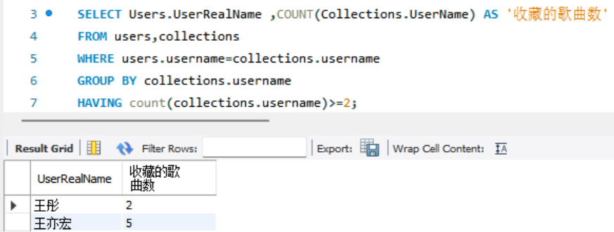
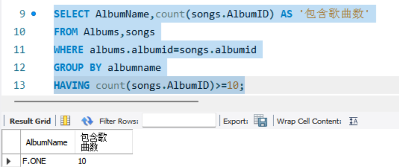
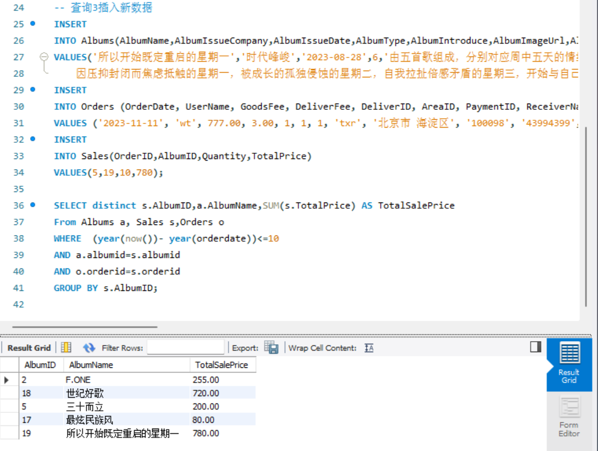
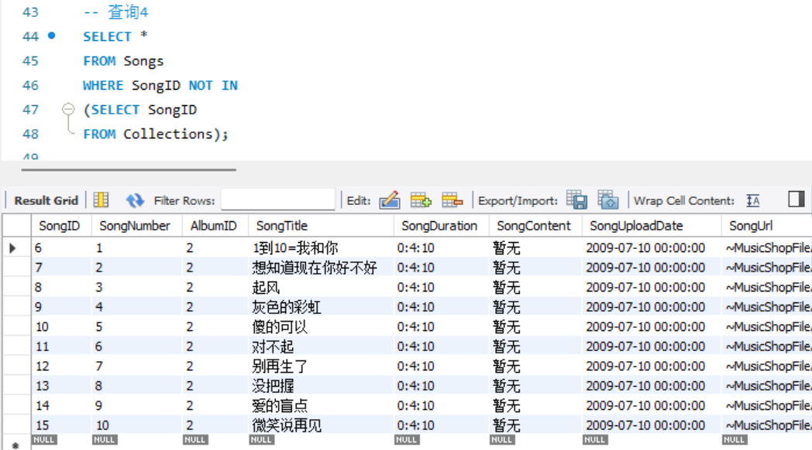
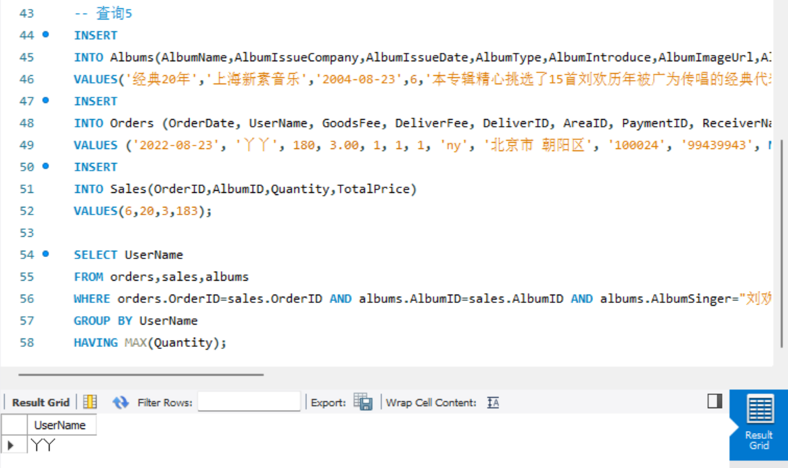
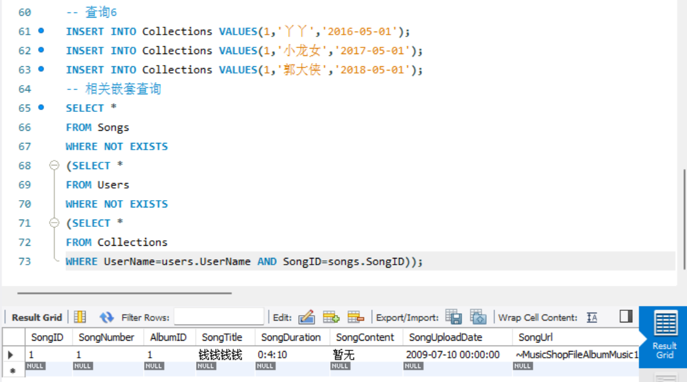
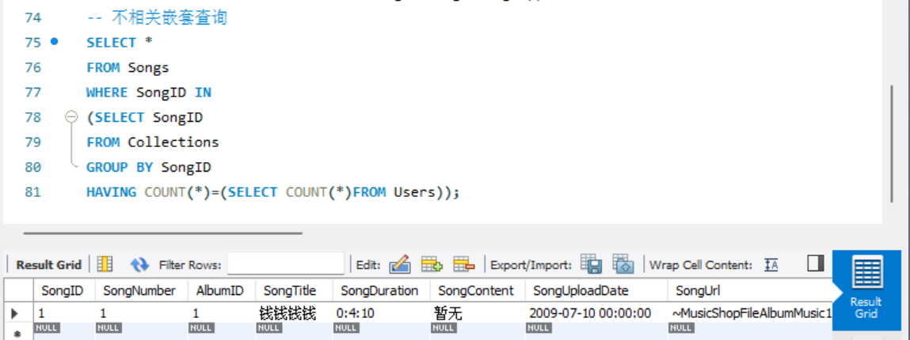
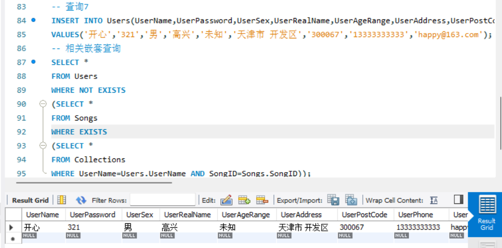
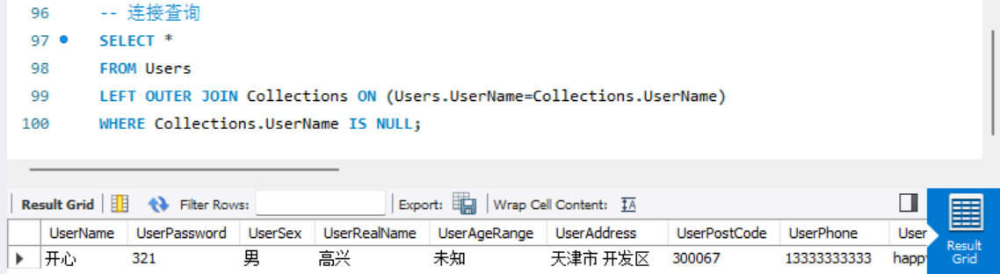

# 构建音乐商店NetMusicShop，并实现复杂查询

### 1、查找收藏歌曲在2首及以上的用户及其收藏的歌曲数



### 2、查找所包含的歌曲数大于等于10首的专辑，显示专辑名和所包含的歌曲数



### 3、查找最近10年来（now（））的专辑销售情况，列出专辑ID、专辑名称、总销售额，按总销售从高到低排名。



### 4、查询没有被收藏过的歌曲



### 5、在购买了歌手刘欢专辑的客户中查询一次购买数量最多的客户的用户名



### 6、查找被所有用户收藏的歌曲（两种实现方式：相关嵌套查询、不相关嵌套查询）





### 7、查找一首歌曲都没有收藏的用户（两种实现方式：相关嵌套查询、连接查询）






# *附sql代码

```
USE netmusicshop;

-- 查询1
SELECT Users.UserRealName ,COUNT(Collections.UserName) AS '收藏的歌曲数'
FROM users,collections
WHERE users.username=collections.username
GROUP BY collections.username 
HAVING count(collections.username)>=2;


-- 查询2
SELECT AlbumName,count(songs.AlbumID) AS '包含歌曲数'
FROM Albums,songs
WHERE albums.albumid=songs.albumid
GROUP BY albumname
HAVING count(songs.AlbumID)>=10;


-- 查询3
INSERT
INTO Albums(AlbumName,AlbumIssueCompany,AlbumIssueDate,AlbumType,AlbumIntroduce,AlbumImageUrl,AlbumSinger,AlbumLanguage,AlbumMarketPrice,AlbumMemberPrice,AlbumIsRecommend)
VALUES('所以开始既定重启的星期一','时代峰峻','2023-08-28',6,'由五首歌组成，分别对应周中五天的情绪。
　　因压抑封闭而焦虑抵触的星期一，被成长的孤独侵蚀的星期二，自我拉扯倍感矛盾的星期三，开始与自己和解的星期四，充满期待的星期五。',NULL,'马嘉祺','汉语普通话',99,77,1);

INSERT 
INTO Orders (OrderDate, UserName, GoodsFee, DeliverFee, DeliverID, AreaID, PaymentID, ReceiverName, ReceiverAddress, ReceiverPostCode, ReceiverPhone, ReceiverEmail, OrderIsPayment, OrderIsConsignment, OrderIsConfirm, OrderIsPigeonhole)
VALUES ('2023-11-11', 'wt', 777.00, 3.00, 1, 1, 1, 'txr', '北京市 海淀区', '100098', '43994399', NULL, 1, 1, 1, 1);

INSERT
INTO Sales(OrderID,AlbumID,Quantity,TotalPrice)
VALUES(5,19,10,780);

SELECT distinct s.AlbumID,a.AlbumName,SUM(s.TotalPrice) AS TotalSalePrice
From Albums a, Sales s,Orders o
WHERE  (year(now())- year(orderdate))<=10
AND a.albumid=s.albumid
AND o.orderid=s.orderid
GROUP BY s.AlbumID;


-- 查询4
SELECT *
FROM Songs
WHERE SongID NOT IN(
SELECT SongID
FROM Collections);


-- 查询5 
INSERT
INTO Albums(AlbumName,AlbumIssueCompany,AlbumIssueDate,AlbumType,AlbumIntroduce,AlbumImageUrl,AlbumSinger,AlbumLanguage,AlbumMarketPrice,AlbumMemberPrice,AlbumIsRecommend)
VALUES('经典20年','上海新素音乐','2004-08-23',6,'本专辑精心挑选了15首刘欢历年被广为传唱的经典代表作',NULL,'刘欢','汉语普通话',80,60,1);

INSERT 
INTO Orders (OrderDate, UserName, GoodsFee, DeliverFee, DeliverID, AreaID, PaymentID, ReceiverName, ReceiverAddress, ReceiverPostCode, ReceiverPhone, ReceiverEmail, OrderIsPayment, OrderIsConsignment, OrderIsConfirm, OrderIsPigeonhole)
VALUES ('2022-08-23', '丫丫', 180, 3.00, 1, 1, 1, 'ny', '北京市 朝阳区', '100024', '99439943', NULL, 1, 1, 1, 1);

INSERT
INTO Sales(OrderID,AlbumID,Quantity,TotalPrice)
VALUES(6,20,3,183);

SELECT UserName 
FROM orders,sales,albums 
WHERE orders.OrderID=sales.OrderID AND albums.AlbumID=sales.AlbumID AND albums.AlbumSinger="刘欢" 
GROUP BY UserName
HAVING MAX(Quantity);


-- 查询6
INSERT INTO Collections VALUES(1,'丫丫','2016-05-01');
INSERT INTO Collections VALUES(1,'小龙女','2017-05-01');
INSERT INTO Collections VALUES(1,'郭大侠','2018-05-01');

-- 相关嵌套查询
SELECT *
FROM Songs
WHERE NOT EXISTS
(SELECT *
FROM Users
WHERE NOT EXISTS
(SELECT *
FROM Collections
WHERE UserName=users.UserName AND SongID=songs.SongID));

-- 不相关嵌套查询
SELECT *
FROM Songs
WHERE SongID IN
(SELECT SongID 
FROM Collections
GROUP BY SongID
HAVING COUNT(*)=(SELECT COUNT(*)FROM Users));


-- 查询7
INSERT INTO Users(UserName,UserPassword,UserSex,UserRealName,UserAgeRange,UserAddress,UserPostCode,UserPhone,UserEmail)
VALUES('开心','321','男','高兴','未知','天津市 开发区','300067','13333333333','happy@163.com');

-- 相关嵌套查询
SELECT *
FROM Users
WHERE NOT EXISTS
(SELECT *
FROM Songs
WHERE EXISTS
(SELECT *
FROM Collections
WHERE UserName=Users.UserName AND SongID=Songs.SongID));

-- 连接查询
SELECT *
FROM Users 
LEFT OUTER JOIN Collections ON (Users.UserName=Collections.UserName)
WHERE Collections.UserName IS NULL;
```
