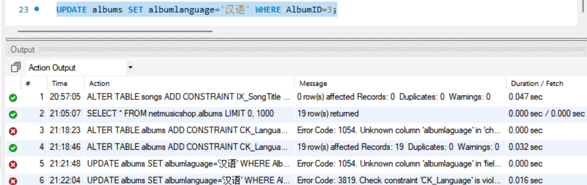
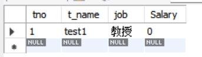
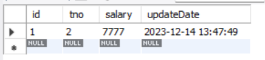
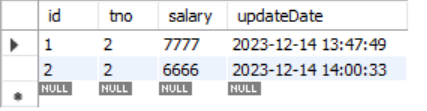

# 完整性实验

## 1.完整性约束

### （1）创建PRIMARY KEY约束（主键约束），将Users表的“用户名”列（UserName）设置为主键

```
-- 先删除原有主键
ALTER TABLE Users DROP primary key ;
-- 重新新建主键
ALTER TABLE Users ADD primary key(username);
```

### （2）创建FOREIGN KEY（外键约束），将Songs表的AlbumID列设置为外键FK_Songs_Album，该外键参照Album表中的主键AlbumID，且违约时采用“级联更新”和“级联删除”的策略。

```
ALTER TABLE Songs 
ADD FOREIGN KEY FK_Songs_Album(AlbumID) 
REFERENCES Albums(AlbumID)
ON UPDATE CASCADE
ON DELETE CASCADE;
-- 删除数据验证级联更新级联删除
DELETE FROM Albums WHERE AlbumID=1;
UPDATE Albums  SET AlbumID=22 WHERE AlbumID=2;
```

### （3）创建UNIQUE约束（唯一性约束），为Songs表的“歌曲名”列（SongTitle）创建唯一性约束IX_SongTitle。

```
-- 删除原有约束
ALTER TABLE songs modify SongTitle varchar(256) NULL;
-- 创建unique约束
ALTER TABLE songs ADD CONSTRAINT IX_SongTitle UNIQUE(SongTitle);
```

### (4)（4）创建CHECK约束（检查约束），为Album表的“专辑语言”列（AlbumLanguage）创建一个检查约束CK_Language，使得“专辑语言”的取值范围为“汉语普通话、粤语、英语、日语、韩语、多国、其他”之一。

```
-- 创建check约束
ALTER TABLE albums ADD CONSTRAINT CK_Language CHECK(albumlanguage IN('汉语普通话','粤语','英语','日语','韩语','多国','其他'));
```

检验是否起作用：



报错，可见起作用

## 2.触发器

### 创建Before触发器

（1）创建教师表

```
CREATE DATABASE Teachers;
USE Teachers;
CREATE TABLE  Teacher
(tno INT PRIMARY KEY AUTO_INCREMENT,
 t_name VARCHAR(20),
 job VARCHAR(10),
 Salary DOUBLE
 );
 
 insert into teacher(t_name,job,Salary)
 VALUES('test1','教授',7777);
```

（2）定义一个名为before_Sal_update的before update触发器

```
-- 定义一个名为before_Sal_update的before update触发器
 delimiter &&
 CREATE TRIGGER before_Sal_update BEFORE UPDATE ON Teacher 
 FOR EACH ROW
 BEGIN
   IF NEW.Salary<0 
   THEN
   SET NEW.SalarY=0;
   END IF;
END &&
delimiter ;
```

update命令测试是否成功

```
-- 测试update命令测试是否成功
UPDATE teacher SET Salary=-100
WHERE  t_name='test1';
```

成功



### 创建after触发器

（1）增加工资变化日志表

```
-- 增加工资变化日志表
CREATE TABLE sal_log(
id INT PRIMARY KEY AUTO_INCREMENT,
tno INT,
salary DOUBLE,
updateDate DATETIME,
FOREIGN KEY(tno) REFERENCES Teacher(tno)
)
```

（2）定义一个名为after_Sal_insert的after insert触发器，该触发器实现，当新增一个教师记录时，将该教师当时工资插入到工资变化日志表中

```
delimiter &&
CREATE TRIGGER after_Sal_insert AFTER INSERT ON teacher
FOR EACH ROW
BEGIN
   INSERT INTO sal_log(tno,salary,updateDate)
   VALUES(new.tno,current_salary,current_time);
END &&
delimiter ;
```

INSERT命令测试成功

```
insert into teacher(t_name,job,Salary)
VALUES('test2','教授',7777);
```



（3）定义一个名为after_Sal_update的after update触发器，该触发器实现，当修改教师工资时，将该教师修改后的工资插入到工资变化日志表中

```
delimiter &&
CREATE TRIGGER after_Sal_update AFTER UPDATE ON teacher
FOR EACH ROW
BEGIN
   IF(new.salary<>old.salary) THEN
   INSERT INTO sal_log(tno,salary,updateDate)
   VALUES(new.tno,new.salary,current_time);
   END IF;
END &&
delimiter ;
```

UPDATE命令测试成功

```
UPDATE Teacher SET salary=6666 WHERE t_name="test2";
```



## *附sql代码

```
USE netmusicshop;

-- 先删除原有主键
ALTER TABLE Users DROP primary key ;
-- 重新新建主键
ALTER TABLE Users ADD primary key(username);

ALTER TABLE Songs 
ADD FOREIGN KEY FK_Songs_Album(AlbumID) 
REFERENCES Albums(AlbumID)
ON UPDATE CASCADE
ON DELETE CASCADE;
-- 删除数据验证级联更新级联删除
DELETE FROM Albums WHERE AlbumID=1;
UPDATE Albums  SET AlbumID=22 WHERE AlbumID=2;

-- 删除原有约束
ALTER TABLE songs modify SongTitle varchar(256) NULL;
-- 创建unique约束
ALTER TABLE songs ADD CONSTRAINT IX_SongTitle UNIQUE(SongTitle);

-- 创建check约束
ALTER TABLE albums ADD CONSTRAINT CK_Language CHECK(albumlanguage IN('汉语普通话','粤语','英语','日语','韩语','多国','其他'));
-- 检验是否起作用
UPDATE albums SET albumlanguage='汉语' WHERE AlbumID=3;

CREATE DATABASE Teachers;
USE Teachers;
CREATE TABLE  Teacher
(tno INT PRIMARY KEY AUTO_INCREMENT,
 t_name VARCHAR(20),
 job VARCHAR(10),
 Salary DOUBLE
 );
 
 insert into teacher(t_name,job,Salary)
 VALUES('test1','教授',7777);
 
 -- 定义一个名为before_Sal_update的before update触发器
 delimiter &&
 CREATE TRIGGER before_Sal_update BEFORE UPDATE ON Teacher 
 FOR EACH ROW
 BEGIN
   IF NEW.Salary<0 
   THEN
   SET NEW.SalarY=0;
   END IF;
END &&
delimiter ;
-- 测试update命令测试是否成功
UPDATE teacher SET Salary=-100
WHERE  t_name='test1';

-- 增加工资变化日志表
CREATE TABLE sal_log(
id INT PRIMARY KEY AUTO_INCREMENT,
tno INT,
salary DOUBLE,
updateDate DATETIME,
FOREIGN KEY(tno) REFERENCES Teacher(tno)
)

delimiter &&
CREATE TRIGGER after_Sal_insert AFTER INSERT ON teacher
FOR EACH ROW
BEGIN
   INSERT INTO sal_log(tno,salary,updateDate)
   VALUES(new.tno,current_salary,current_time);
END &&
delimiter ;
 
insert into teacher(t_name,job,Salary)
 VALUES('test2','教授',7777);

delimiter &&
CREATE TRIGGER after_Sal_update AFTER UPDATE ON teacher
FOR EACH ROW
BEGIN
   IF(new.salary<>old.salary) THEN
   INSERT INTO sal_log(tno,salary,updateDate)
   VALUES(new.tno,new.salary,current_time);
   END IF;
END &&
delimiter ;

UPDATE Teacher SET salary=6666 WHERE t_name="test2";
```