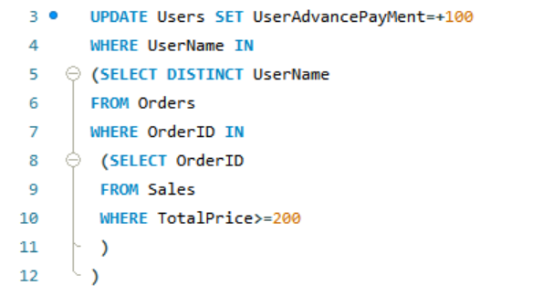
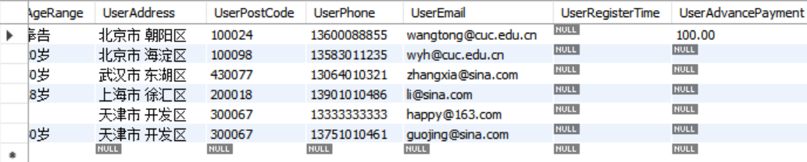
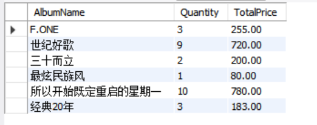
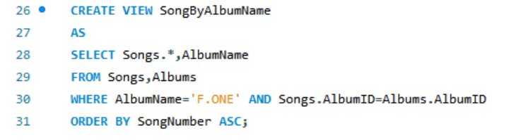
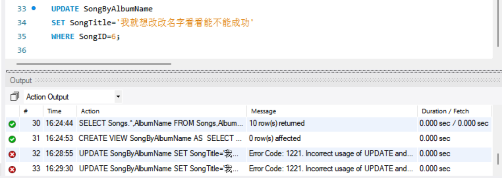
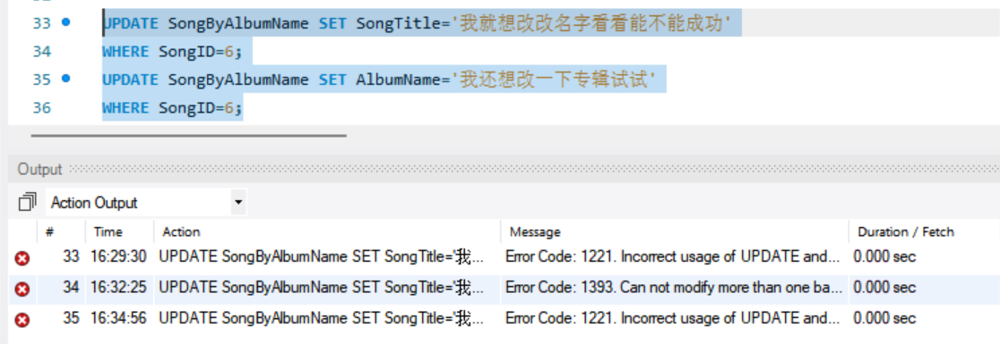

# 批量操作及视图练习

### 实验内容

（1）商家开展“买200赠100”的促销活动，为一次购买某专辑总价格在200元（含）以上的用户的会员卡（字段：User表的UserAdvancePayment）充值100元。（只充值一次）

（2）新建“专辑销售统计表”Sales_Statis，其结构能存放专辑名、销售量和销售额。将各个专辑销售量和销售额的统计结果存入Sales_Statis表中

（3）创建专辑名为“三十而立”（可自定义其他名称）的歌曲视图SongsByAlbumName，该视图包括“歌曲表”中的所有列以及专辑名称，并按歌曲顺序号由小到大排列

（4）将此视图中选择任意SongId，修改歌曲名称为“我就想改改名字看看能不能成功”，看看是否成功

无法修改成功

（5）将此视图中选择任意SongId，修改歌曲名称为“我就想改改名字看看能不能成功”，专辑名称修改为“我还想改一下专辑试试”，看看是否成功？

无法修改成功

