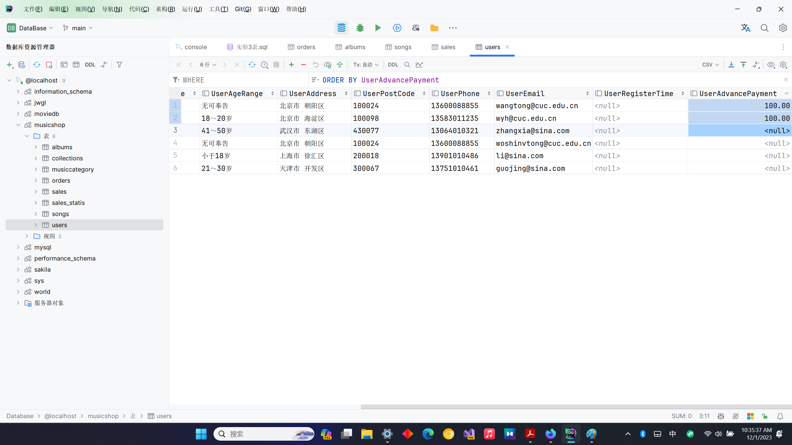
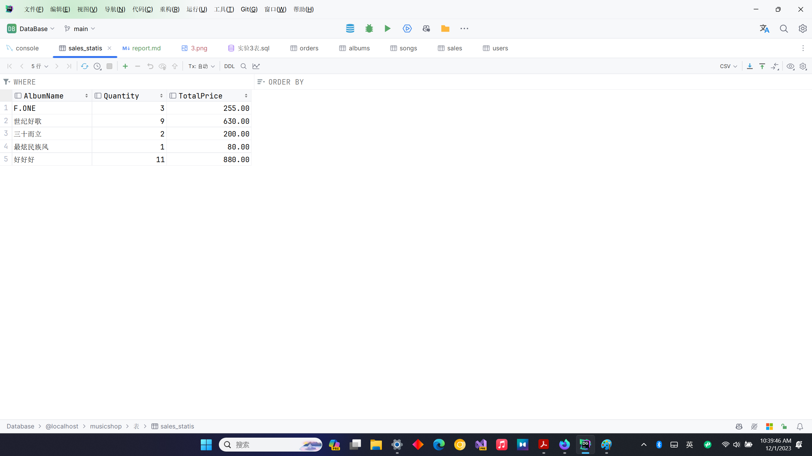
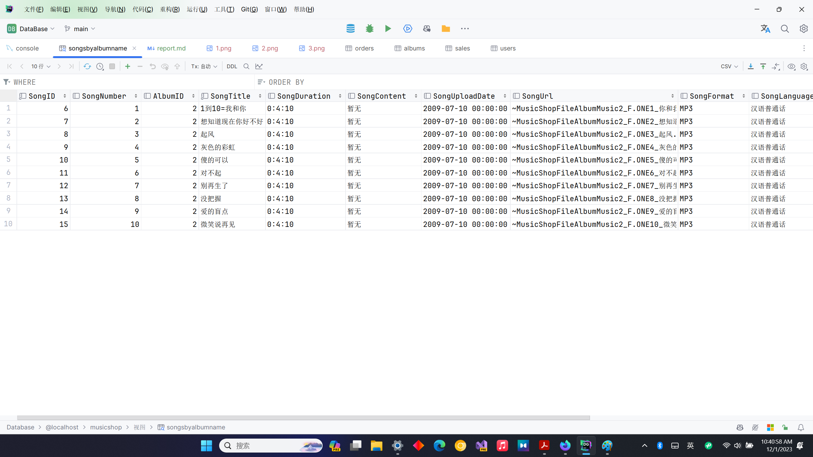
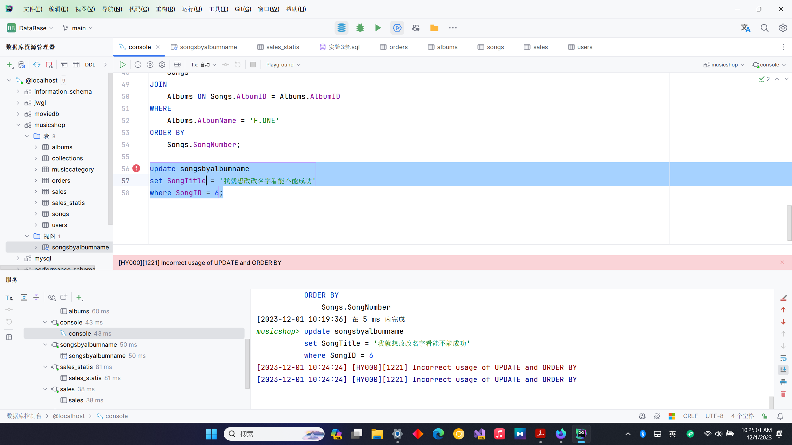

# report

## 过程
### 1.商家开展“买200赠100”的促销活动，为一次购买某专辑总价格在200元（含）以上的用户的会员卡（字段：User表的UserAdvancePayment）充值100元。（只充值一次）


### 2. 新建“专辑销售统计表”Sales_Statis，其结构能存放专辑名、销售量和销售额。将各个专辑销售量和销售额的统计结果存入Sales_Statis表中


### 3.创建专辑名为“三十而立”（可自定义其他名称）的歌曲视图SongsByAlbumName，该视图包括“歌曲表”中的所有列以及专辑名称，并按歌曲顺序号由小到大排列


### 4.将此视图中选择任意SongId，修改歌曲名称为“我就想改改名字看看能不能成功”，看看是否成功？


### 5.将此视图中选择任意SongId，修改歌曲名称为“我就想改改名字看看能不能成功”，专辑名称修改为“我还想改一下专辑试试”，看看是否成功？


### 6.对于视图是否能修改成功，相关的因素有哪些？请一一列举并举例说明，附上测试结果
视图的修改能否成功，主要取决于以下几个因素：  
视图的定义：如果视图是由多个表联接而成，或者包含聚合函数、分组、DISTINCT等，那么这个视图就是不可更新的。例如，我们在上面的例子中创建的"SongsByAlbumName"视图就是不可更新的，因为它是由"Songs"表和"Albums"表联接而成的。  
基础表的约束：如果基础表有任何阻止更新的约束（如主键、外键、CHECK约束等），那么视图也不能更新。例如，如果"Songs"表的"SongID"是主键，那么我们不能通过视图更改这个字段的值。  
视图的权限：如果用户没有对基础表的更新权限，那么他们也不能更新视图。例如，如果用户只有对"SongsByAlbumName"视图的SELECT权限，而没有对"Songs"表和"Albums"表的UPDATE权限，那么他们就不能通过视图更新歌曲名称或专辑名称。  
视图的WITH CHECK OPTION：如果视图定义中包含WITH CHECK OPTION，那么只有当更新后的数据仍满足视图的WHERE条件时，更新才会成功。例如，如果我们在"SongsByAlbumName"视图的定义中添加了WITH CHECK OPTION，并且WHERE条件是"Albums.AlbumName = '三十而立'"，那么只有当更新后的专辑名称仍为"三十而立"时，更新才会成功。

#### 测试用例：
```SQL
-- 创建一个可更新的视图
CREATE VIEW UpdatableSongs AS
SELECT SongID, SongTitle
FROM Songs;

-- 尝试更新视图
UPDATE UpdatableSongs
SET SongTitle = '新的歌曲名称'
WHERE SongID = 1;

-- 查询视图来确认更改是否成功
SELECT * FROM UpdatableSongs WHERE SongID = 1;

-- 创建一个包含WITH CHECK OPTION的视图
CREATE VIEW SongsByAlbumNameWithCheck AS
SELECT Songs.SongID, Songs.SongTitle, Albums.AlbumName
FROM Songs
JOIN Albums ON Songs.AlbumID = Albums.AlbumID
WHERE Albums.AlbumName = '三十而立'
WITH CHECK OPTION;

-- 尝试更新视图
UPDATE SongsByAlbumNameWithCheck
SET SongTitle = '新的歌曲名称', AlbumName = '新的专辑名称'
WHERE SongID = 1;

-- 查询视图来确认更改是否成功
SELECT * FROM SongsByAlbumNameWithCheck WHERE SongID = 1;
```

## 完整代码
```SQL
-- 创建一个临时表来存储已经充值的用户
create temporary table if not exists temp_1(
    username varchar(50)
);

-- 找出购买专辑总价格在200元（含）以上的订单
insert into temp_1(username)
select distinct orders.UserName
from orders
where GoodsFee >= 200;

-- 为这些用户的会员卡充值100元
update users
set UserAdvancePayment = UserAdvancePayment + 100
where UserName in (select username from temp_1);

-- 删除临时表
drop table temp_1;


-- 创建“专辑销售统计表”Sales_Statis
CREATE TABLE Sales_Statis(
    AlbumName varchar(64),
    Quantity int,
    TotalPrice numeric(10, 2)
);

-- 存入数据
insert into Sales_Statis(albumname, quantity, totalprice)
select
    Albums.AlbumName,
    SUM(Sales.Quantity),
    SUM(Sales.Quantity * Albums.AlbumMemberPrice)
from
    sales
        JOIN
    Albums ON Sales.AlbumID = Albums.AlbumID
group by
    Albums.AlbumName;


CREATE VIEW SongsByAlbumName AS
SELECT
    Songs.*,
    Albums.AlbumName
FROM
    Songs
JOIN
    Albums ON Songs.AlbumID = Albums.AlbumID
WHERE
    Albums.AlbumName = 'F.ONE'
ORDER BY
    Songs.SongNumber;


update songsbyalbumname
set SongTitle = '我就想改改名字看能不能成功'
where SongID = 6;

update songsbyalbumname
set SongTitle = '我就想改改名字看能不能成功',
    AlbumName = '我还想改改专辑试试'
where SongID = 6;


-- 创建一个可更新的视图
CREATE VIEW UpdatableSongs AS
SELECT SongID, SongTitle
FROM Songs;

-- 尝试更新视图
UPDATE UpdatableSongs
SET SongTitle = '新的歌曲名称'
WHERE SongID = 1;

-- 查询视图来确认更改是否成功
SELECT * FROM UpdatableSongs WHERE SongID = 1;

-- 创建一个包含WITH CHECK OPTION的视图
CREATE VIEW SongsByAlbumNameWithCheck AS
SELECT Songs.SongID, Songs.SongTitle, Albums.AlbumName
FROM Songs
JOIN Albums ON Songs.AlbumID = Albums.AlbumID
WHERE Albums.AlbumName = 'Eye Fever演唱会09'
WITH CHECK OPTION;

-- 尝试更新视图
UPDATE SongsByAlbumNameWithCheck
SET SongTitle = '新的歌曲名称', AlbumName = '新的专辑名称'
WHERE SongID = 1;

-- 查询视图来确认更改是否成功
SELECT * FROM SongsByAlbumNameWithCheck WHERE SongID = 1;
```